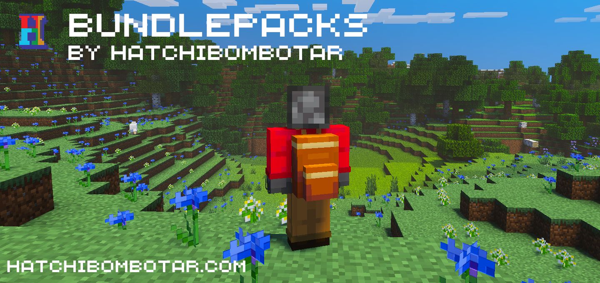
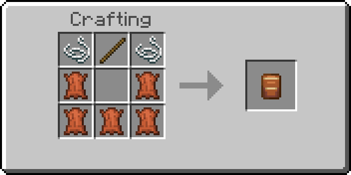
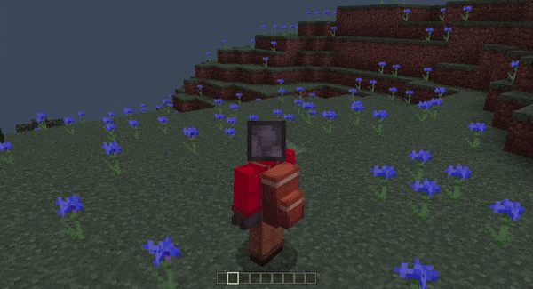

# Bundlepacks
Last release tested for version 1.21.0

This addon adds backpacks to the game! They allow you to move large amounts of items from place to place or just to use them for more inventory space cheaply.

This add-on adds bundlepacks, a cheap form of the bundle. These bundlepacks can hold up to 27 stacks of items at a time.

The crafting recipe to create the bundlepack item.

Walking around has a nice animation.

## How to use:
### Keyboard/Mouse:
- Hold the item in your hand
- Right click to open the bundlepack as a normal container.
### Controller:
- Hold the item in your hand
- Use the interact button to open the bundlepack as a normal container.
### Touch:
- Hold the item in your hand
- Wait for the open button to appear above your hotbar
- Press the button and use the bundlepack as a normal container.

## Limitations
There are some items that are unable to be stored inside bundlepacks due to technical limitations. A sound plays if the item doesn't work and a message will appear in chat.